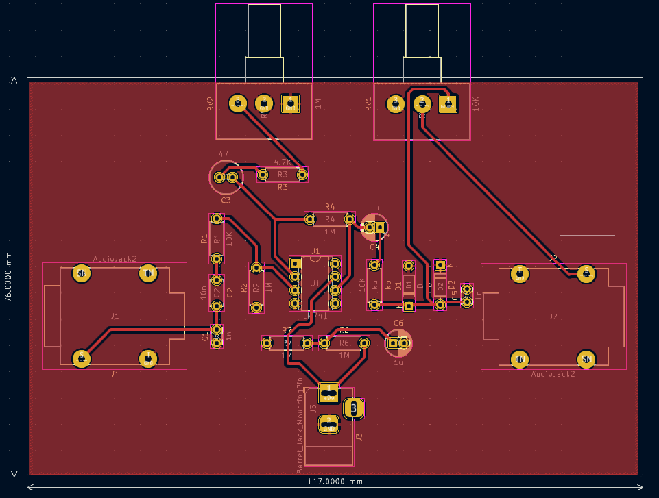

# PCB Design - MXR Distortion

In this document it'll describe design rules, constraints, criteria and features about `MXR Distortion PCB`.

## Constraints

In the follow image we can see the constraints implemented.

These are test contraints example. That's must be changed due to routes width are low.

## Considerations

- Implement footswitch in the input circuit. One connection to the distortion circuit, other to clean signal.

## Board

- Remove Jacks 3.5mm. Connections through wires.

## References

[MXR Distortion + Analysis](https://www.electrosmash.com/mxr-distortion-plus-analysis)

[KiCad 4.0.7 - Clase 6 - Imprimir PCB y Serigrafía](https://www.youtube.com/watch?v=1kVmtgB8eXo)

[KiCad 6: Ground Plane (Filled Zone)](https://www.youtube.com/watch?v=8NV5cuPbVm0)

[Kicad Tutorial](https://www.youtube.com/watch?v=vtUj1Ba_ELk)

[Kicad 6: Set Grid Origin](https://www.youtube.com/watch?v=jXpuGUENB9k)

[Kicad Ground Planes Tutorial (1m)](https://www.youtube.com/watch?v=DNTgrTukltw)

[Adding Custom Logo on PCB | Add Logo under 5 minutes | KiCAD Beginners](https://www.youtube.com/watch?v=dcou-_67rO8)

[PCB Designing - Layout measurement (KiCAD in English)](https://www.youtube.com/watch?v=AhPa2fO74DI)

[#10 How To Do PCB Routing In KiCad 7.0 with Basic PCB Design Rules | #PCBCupid](https://www.youtube.com/watch?v=9HpYpP2L10A)

